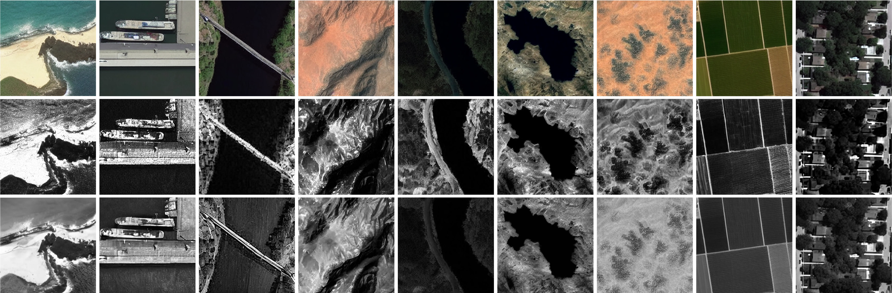
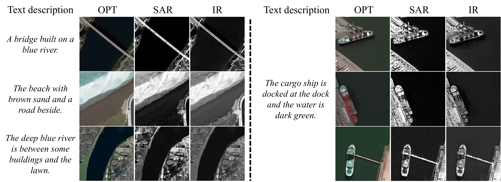
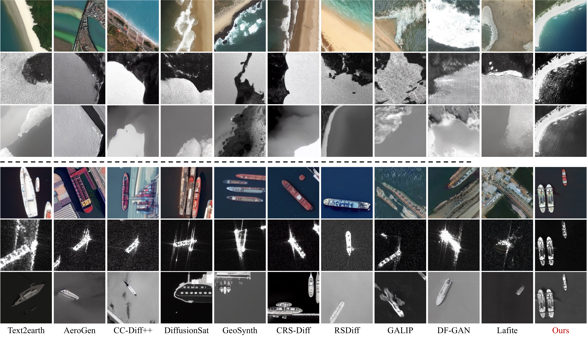
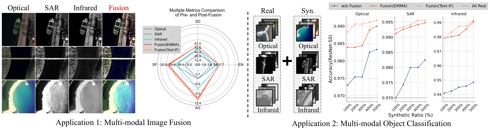

<div align="center">


# MMDiff: Multi-modal Remote Sensing Image Generation via Cross-Modality Spatial Feature Transfer

<div  align="center" style="margin-top:10px;"> 

<p><span style="font-size: 26px;"><strong>ISPRS 2026 &#128293;</strong></span></p>
<div align="center">

**Haojun Tang**<sup>1</sup> · **Wenda Zhao**<sup>1,*</sup> · **Hengshuai Cui**<sup>1</sup> · **Haipeng Wang**<sup>2</sup>

<sup>1</sup> Dalian University of Technology  
<sup>2</sup> Unit 92728 of PLA

</div>

<div align="center">

[](https://xinr-tang.github.io/MMDiff-homepage/)
[](#)
[](https://huggingface.co/XinRan-Tang/MM-Diff)
[](https://huggingface.co/datasets/XinRan-Tang/Optical-SAR-Infrared)

</div>

<sup>*</sup> **Corresponding author:**

</div>


## Abstract

<div align="justify">

Collecting spatially consistent multi-modal remote sensing (MMRS) images remains challenging due to different sensors vary in the imaging principles and acquisition times. This hinders the development of data-driven MMRS technologies, which rely on large-scale training samples. This paper proposes MMDiff, the first text-driven diffusion framework explicitly designed for jointly generating structurally consistent optical (OPT), synthetic aperture radar (SAR), and infrared (IR) remote sensing images from a single text prompt via cross-modality spatial feature transfer. MMDiff first trains the OPT branch with paired optical image-text data to capture rich semantic content, and then trains the SAR/IR branches with simple modality-specific text templates to learn the corresponding style attributes, without relying on complex linguistic descriptions. Specifically, we introduce a LoRA-based modality translation adaptation mechanism to translate the style attributes of optical spatial representations to SAR and IR style attributes while preserving the underlying semantic content. The translated representations are then transferred into the SAR and IR generation branches through the proposed spatial feature transfer mechanism, enabling rich spatial details in the generated SAR/IR images while maintaining cross-modal spatial consistency. Extensive experiments demonstrate that MMDiff achieves superior image quality in terms of modality similarity and semantic consistency compared to the state-of-the-art methods. Furthermore, MMDiff benefits downstream data-driven MMRS applications, e.g., multi-modal image fusion and object classification.

</div>

<p align="center"></p>
<p align="center" style="margin-top: -10px;"><span style="color: gray; font-size: 14px;">From top to bottom: optical (OPT), synthetic aperture radar (SAR), and infrared (IR) images.</span></p>

<div align="left">

## 📢 &nbsp; Latest Updates

- **2026-08-25** — Training code will be released soon.
- **2026-08-25** — Dataset and model are available on Hugging Face 🎊 ！
- **2026-08-25** — Sampling code is now available ✨.
- **2026-08-15** — Our paper has been accepted by **ISPRS 2026**  🎉 🎉 🎉 !!! 


## 📊 &nbsp; Main Results

### 1️⃣ &nbsp; Text-to-spatially-consistent Optical, Synthetic Aperture Radar, and Infrared Generation

<p align="center"></p>

### 2️⃣ &nbsp; Comparison with Existing Methods

<p align="center"></p>

### 3️⃣ &nbsp; Downstream Tasks

<p align="center"></p>

## 🚀 Quick Start

### 🛠️ Installation

Create and activate a Conda environment, then install the required packages:

```bash
git clone https://github.com/XinR-Tang/MMDiff
cd MMDiff

conda create -n mmdiff python=3.10 -y
conda activate mmdiff
pip install -r requirements.txt
```

### 📦 Model Placement

Download the model files from [MMDiff](https://huggingface.co/XinRan-Tang/MM-Diff) and place them under `models/MMDiff/` in the project root. The expected layout is:

```text
MMDiff/
└── models/
    └── MMDiff/
        ├── mmdiff-opt/
        ├── mmdiff-sar/
        └── mmdiff-ir/
```

### 🛠️ Sampling

All inference parameters are configured in [`mmdiff/config.py`](mmdiff/config.py). Before sampling, set the prompt, seed, output name, device, and model paths in `SamplingConfig`. By default, the model paths point to:

```text
./models/MMDiff/mmdiff-opt
./models/MMDiff/mmdiff-sar/sd-sar-lora-ship
./models/MMDiff/mmdiff-ir/sd-ir-lora-ship
```

The OPT pipeline automatically saves its spatial features to `./features/visible_attn_maps/` and `./features/visible_resnet_maps/`. The subsequent SAR and IR pipelines read these two directories, so keep them available until all three modalities have been generated. You can change both locations through `attn_path` and `resnet_path` in `SamplingConfig`.

Then activate the environment and run the three-modality sampling pipeline:

```bash
cd /path/to/MMDiff
conda activate mmdiff
PYTHON="$CONDA_PREFIX/bin/python" bash scripts/sampling.sh
```

Generated OPT, SAR, and IR images are saved under `result/opt/`, `result/sar/`, and `result/ir/`, respectively.


</div>

